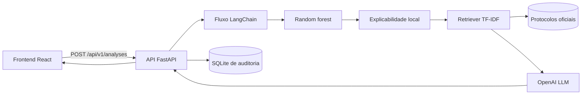

# Guardiã AI — triagem de risco materno

Aplicação acadêmica que combina dados, Machine Learning, LLM, RAG e interface web para apoiar profissionais na triagem inicial de risco durante a gestação.

> **Aviso:** a Guardiã AI não foi validada clinicamente. O resultado não constitui diagnóstico, prescrição ou decisão clínica automática. A avaliação e a decisão final permanecem com o profissional de saúde.

## O que foi implementado

- Frontend React + TypeScript separado do backend.
- Backend FastAPI com contrato validado e documentação OpenAPI.
- Treinamento reproduzível de regressão logística multinomial e random forest.
- Comparação por accuracy, precision/recall/F1 macro, recall por classe e matriz de confusão.
- Seleção priorizando recall de alto risco e impacto de falsos negativos.
- Explicabilidade global e local por decomposição exata dos caminhos da random forest.
- Fluxo principal orquestrado com LangChain.
- RAG lexical local sobre 16 seções de quatro fontes oficiais brasileiras.
- Integração configurável com OpenAI; modelo padrão `gpt-5.6-luna`.
- Indicação das fontes recuperadas em cada análise.
- Logging e auditoria em SQLite, incluindo entradas, resultado, modelo, fontes e uso da LLM.
- Dockerfiles separados e Docker Compose.
- Testes de ML, RAG, API e persistência.
- Relatório técnico em PDF, versão aprofundada e editável em DOCX e roteiro para o vídeo de demonstração.

## Arquitetura



O frontend e o backend são projetos independentes em `frontend/` e `backend/`. O retriever funciona localmente. Quando uma chave é configurada, a classificação, as probabilidades, os seis valores clínicos com suas contribuições, a pergunta e as sínteses recuperadas são enviados à OpenAI para gerar a explicação.

## Execução com Docker

Requisitos: Docker Engine e Docker Compose.

```bash
cp .env.example .env
```

Preencha `OPENAI_API_KEY` no `.env` para executar a explicação por LLM. Depois:

```bash
docker compose up --build
```

- Aplicação: http://localhost:8080
- API: http://localhost:8000
- Swagger/OpenAPI: http://localhost:8000/docs
- Saúde da API: http://localhost:8000/health

Sem chave, ML, explicabilidade, recuperação documental e auditoria continuam funcionando. A resposta informa `llm_used=false` e não simula uma explicação por LLM.

## Execução local

### Backend

Requisitos: Python 3.12 ou posterior.

```bash
python3 -m venv .venv
source .venv/bin/activate
python -m pip install -e 'backend[dev]'
cp backend/.env.example backend/.env
cd backend
uvicorn app.main:app --reload
```

Para repetir o treinamento:

```bash
cd backend
python -m training.train \
  --data data/raw/maternal_health_risk.csv \
  --output-dir artifacts \
  --model-version 1.0.0
```

### Frontend

Requisitos: Node.js 22 ou posterior.

```bash
cd frontend
npm install
npm run dev
```

O Vite encaminha `/api` ao backend durante o desenvolvimento. Consulte o README do frontend para os comandos específicos.

## Jornada da API

```bash
curl -X POST http://localhost:8000/api/v1/analyses \
  -H 'Content-Type: application/json' \
  -d '{
    "age": 35,
    "systolic_bp": 140,
    "diastolic_bp": 90,
    "blood_sugar": 13.0,
    "body_temperature": 98.0,
    "heart_rate": 70,
    "question": "O que os protocolos informam sobre a pressão arterial?"
  }'
```

`body_temperature` usa Fahrenheit e `blood_sugar` usa mmol/L, conforme o dataset. Os intervalos aceitos pela API representam apenas o domínio observado durante o treinamento, não faixas clínicas normais.

Endpoints:

| Método | Caminho | Finalidade |
|---|---|---|
| `POST` | `/api/v1/analyses` | Executar ML → explicabilidade → RAG → LLM → auditoria |
| `GET` | `/api/v1/analyses` | Listar histórico auditável |
| `GET` | `/api/v1/analyses/{id}` | Consultar entrada e resultado registrados |
| `GET` | `/api/v1/model/metrics` | Consultar comparação e métricas dos modelos |
| `GET` | `/health` | Verificar modelo, base RAG e configuração da LLM |

## Dataset e resultados

Dataset escolhido: [ML-Ready Maternal Health Risk Assessment Dataset](https://www.kaggle.com/datasets/arshmankhalid/ml-ready-maternal-health-risk-assessment-dataset). O CSV incorporado possui SHA-256 `1d272d463635f9d4b94f268468253c9dbe1e78e576ee8badb1b773f4d749a752`.

A auditoria encontrou:

- 1.014 registros no arquivo, embora a descrição informe 1.013;
- 562 repetições exatas, restando 452 linhas únicas;
- 35 grupos com os mesmos atributos e rótulos conflitantes;
- uma frequência cardíaca igual a 7, mantida e explicitamente registrada como extremo não verificável;
- ausência de identificador, tempo, idade gestacional, sintomas, histórico e desfecho clínico.

O split agrupou vetores idênticos para impedir vazamento entre treino e teste. A random forest foi selecionada:

| Métrica no holdout | Resultado |
|---|---:|
| Accuracy | 69,66% |
| Precision macro | 64,44% |
| Recall macro | 66,78% |
| F1 macro | 65,37% |
| Recall de alto risco | 90,91% |
| Recall de risco médio | 33,33% |
| Falsos negativos de alto risco | 2 |

Esses resultados são limitados e não sustentam uso clínico. O relatório bruto está em `backend/artifacts/training_report_v1.0.0.json`.

## RAG e LLM

A base usa sínteses rastreáveis de:

- Ministério da Saúde, *Caderneta Brasileira da Gestante*, 2026.
- Ministério da Saúde, *Manual de Gestação de Alto Risco*, 2022.
- Ministério da Saúde/SAPS, *Linha de Cuidado do Pré-natal de Baixo Risco*.
- Ministério da Saúde, OPAS/OMS Brasil, FEBRASGO e SBD, *Cuidados Obstétricos em Diabetes Mellitus Gestacional no Brasil*, 2021.

O prompt exige resposta em português, uso exclusivo das sínteses rastreáveis recuperadas, citação `[1]`, `[2]`, declaração de insuficiência e proíbe diagnóstico, prescrição ou decisão automática. A escolha do modelo padrão segue a [documentação oficial de modelos da OpenAI](https://developers.openai.com/api/docs/models); ela pode ser alterada por `OPENAI_MODEL`/`GUARDIA_OPENAI_MODEL`.

## Segurança e privacidade

Este é um protótipo acadêmico local, sem autenticação ou autorização. Não o exponha à internet nem o use com dados reais. A API persiste os seis valores, a pergunta e o resultado para cumprir o requisito de auditoria, e os endpoints de histórico permitem consultar esses registros.

O formulário não possui campos de identificação. Ainda assim, a pergunta é texto livre: não inclua nome, documento, telefone, endereço, prontuário ou qualquer outro dado que identifique uma pessoa. Quando a LLM está habilitada, os dados descritos na seção anterior são enviados ao provedor configurado.

## Testes

```bash
cd backend
pytest
ruff check app training tests ../docs/generate_report.py ../docs/generate_report_docx.py

# Regenerar os relatórios a partir dos artefatos do projeto
python ../docs/generate_report.py
python ../docs/generate_report_docx.py

cd ../frontend
npm test
npm run build
```

Os testes não fazem chamadas pagas nem dependem de rede.

## Estrutura

```text
.
├── backend/
│   ├── app/                 API, ML, RAG, LangChain e auditoria
│   ├── artifacts/           modelo e métricas versionados
│   ├── data/                dataset e base de conhecimento
│   ├── tests/
│   ├── training/            exploração, preparo e treinamento
│   └── Dockerfile
├── frontend/                aplicação React independente
├── docs/
│   ├── relatorio-tecnico.pdf
│   ├── relatorio-tecnico.docx
│   ├── generate_report.py
│   ├── generate_report_docx.py
│   └── roteiro-video.md
├── docker-compose.yml
└── POSTECH - HACKA IADT - Secretaria - Fase 5.pdf
```

## Entregáveis

- Código, scripts de treinamento, instruções, README, aplicação web, API e Dockerfiles: presentes.
- Relatório técnico: [PDF](docs/relatorio-tecnico.pdf) e [DOCX aprofundado e editável](docs/relatorio-tecnico.docx).
- Roteiro da demonstração: [docs/roteiro-video.md](docs/roteiro-video.md).
- Repositório Git: antes da entrega, confirme que todos os arquivos listados aqui estão versionados no remoto.
- Publicação do vídeo: exige gravação e acesso do grupo a uma conta do YouTube ou Vimeo.
